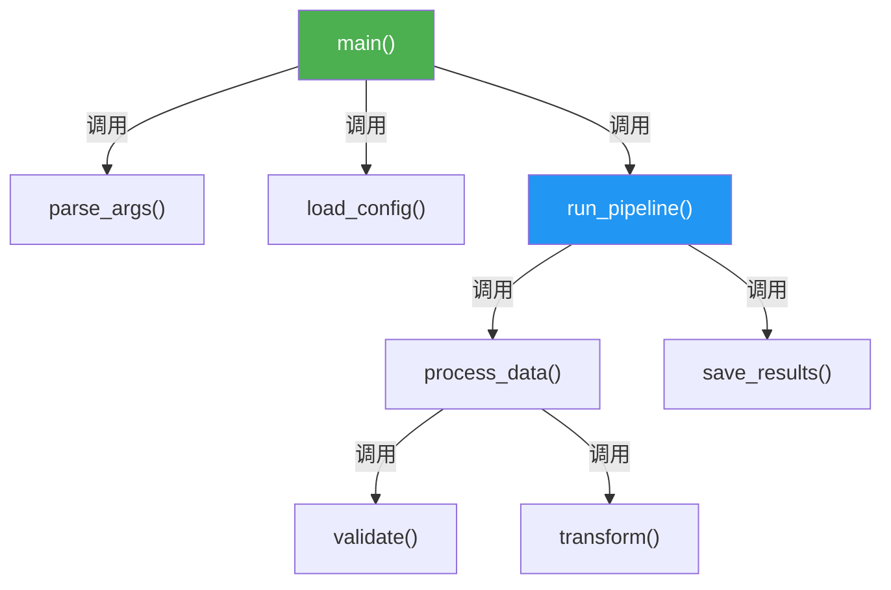
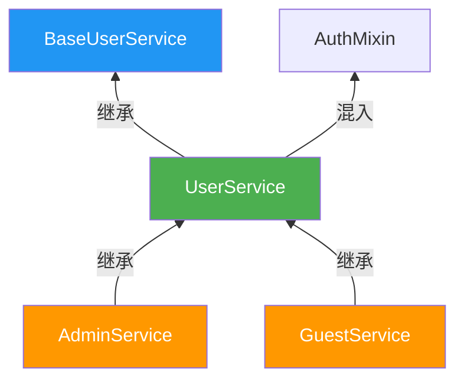

# LATTE - 代码注释智能生成工具

## 1. 项目概述

LATTE 是一个基于 **Node.js + TypeScript** 的命令行工具，自动分析源代码并生成代码注释与流程图。

核心能力：
- 分析函数的调用链（向上：谁调用了它；向下：它调用了谁）→ 生成**流程图**
- 分析类的继承关系（父类、子类）→ 生成**继承图**
- 为函数、类、关键变量生成规范化注释
- 通过 Git 管理注释变更

支持语言：C、汇编、GO、RUST、 Python、Java、C++（后续可扩展）。

未来扩展：提供 Electron 管理界面，支持打开文件夹、可视化查看/创建任务。

---

## 2. 核心概念

### 2.1 分析方向

| 方向 | 参数 | 含义 | 示例 |
|------|------|------|------|
| 向上分析 | `-p 0` | 查找谁调用了目标（调用者 / 父类） | 分析 `foo()` 向上 → `bar()` 调用了 `foo()` |
| 向下分析 | `-p 1` | 查找目标调用了谁（被调用者 / 子类） | 分析 `foo()` 向下 → `foo()` 内部调用了 `baz()` |

默认值：**`-p 1`（向下分析）**。

### 2.2 分析对象

| 对象 | 参数 | 说明 |
|------|------|------|
| 函数 | `-f <方法名>` | 函数名或 `ClassName.method_name` |
| 类 | `-c <类名>` | 类名 |

`-f` 和 `-c` 二选一，必填其一。

### 2.3 任务与子任务

- **任务 (Task)**：一次 `add` 命令对应一个任务，有唯一自增 ID。
- **子任务 (Subtask)**：任务内逐个分析发现的函数/类。初始只有目标本身，执行过程中**动态发现**新函数并追加。

---

## 3. 命令行接口 (CLI)

命令名：`latte-code-notes-agent`

### 3.1 `add` — 创建分析任务

```bash
latte-code-notes-agent add -f <方法名> [-p <0|1>]
latte-code-notes-agent add -c <类名>   [-p <0|1>]
```

| 参数 | 必填 | 默认值 | 说明 |
|------|------|--------|------|
| `-f` | 与 `-c` 二选一 | — | 目标函数名，支持 `func_name` 或 `ClassName.method_name` |
| `-c` | 与 `-c` 二选一 | — | 目标类名 |
| `-p` | 否 | `1` | `0` = 向上，`1` = 向下 |

**执行步骤：**
1. 校验参数（`-f` / `-c` 必须提供且只提供一个）
2. 在项目中搜索目标函数/类，确认存在（不存在则报错退出）
3. **注释完成判定**：检查目标是否已有 LATTE 注释及 `@latte-completed` 标记
   - 无注释 → 继续创建任务
   - 有注释且 SHA-1 匹配（代码未修改）→ 提示"注释已完成，跳过"，不创建任务
   - 有注释但 SHA-1 不匹配（代码已修改）→ 创建任务，子任务状态为 `needs_update`
4. 自增生成任务 ID
5. 写入 `.latte/notes_list.json`（追加任务条目）
6. 创建目录 `.latte/notes/<ID>/`
7. 生成 `.latte/notes/<ID>/task.json`（含第一个子任务：目标本身）
8. 输出确认信息

**输出示例：**
```
✓ 任务已创建 (ID: 1)
  目标: 函数 main
  方向: 向下分析 (-p 1)
  子任务: 1 个（执行时会动态发现更多）
```

**跳过已完成注释的示例：**
```
✓ 注释已完成，跳过任务创建
  目标: 函数 process_data
  文件: src/processor.py:42
  原因: 代码未修改，注释仍然有效 (SHA-1: a1b2c3d4)
```

**代码已修改的示例：**
```
⚠ 注释已过期，代码已修改 (ID: 3)
  目标: 函数 handle_request
  文件: src/api.py:20
  原因: 代码已修改，注释需要更新 (旧 SHA-1: e5f6a7b8)
  子任务: 1 个（状态: needs_update）
```

### 3.2 `run` — 执行一个子任务

```bash
latte-code-notes-agent run            # 默认取最近一个 in_progress 的任务
latte-code-notes-agent run <任务ID>   # 执行指定任务
```

| 参数 | 必填 | 默认值 | 说明 |
|------|------|--------|------|
| `<任务ID>` | 否 | `notes_list.json` 中最后一个 `in_progress` 任务 | 要执行的任务 ID |

**执行步骤：**
1. 读取 `.latte/notes/<ID>/task.json`，找到状态为 `pending` 或 `needs_update` 的第一个子任务
2. **注释完成判定**：检查该函数/类是否已有 LATTE 注释
   - 有注释且 SHA-1 匹配 → 标记为 `skipped`，跳到步骤 6
   - 有注释但 SHA-1 不匹配 → 继续执行（注释需要更新）
   - 无注释 → 继续执行
3. 标记该子任务为 `running`
4. 分析该子任务对应的函数/类：
   - 解析代码，提取调用关系（函数）或继承关系（类）
   - **动态发现**：发现新的项目内函数/类 → 检查其注释状态后再决定是否添加为子任务
     - 已有有效注释（SHA-1 匹配）→ 不添加子任务，记录日志"注释已完成，跳过"
     - 注释过期或无注释 → 添加为新的 `pending` / `needs_update` 子任务
   - 过滤标准库和第三方库调用（只分析项目内部代码）
5. 为该函数/类生成代码注释，写入源文件：
   - 计算去除 LATTE 注释后的代码 SHA-1
   - 在注释末尾添加 `@latte-completed SHA-1:<hash>` 标记
   - 更新子任务的 `code_sha1` 和 `comment_status` 字段
6. 标记该子任务为 `completed`（或 `skipped`）
7. 检查是否还有 `pending` / `needs_update` 子任务：
   - **还有** → 输出进度，等待下次 `run` 或 `loop`
   - **没有了** → 生成流程图/继承图，执行 `git commit`
8. 追加日志到 `.latte/notes/<ID>/log.md`

**输出示例：**
```
▶ 任务 #1 | 子任务 #3: 分析函数 process_data()
  文件: src/processor.py:42
  发现调用: validate_input() → 新增子任务 #7
  发现调用: transform()     → 新增子任务 #8
  已生成函数注释 ✓
  进度: 3/8 子任务完成
```

**跳过已完成注释的示例：**
```
▶ 任务 #1 | 子任务 #5: 分析函数 validate_input()
  文件: src/validator.py:15
  已有 LATTE 注释，SHA-1 校验通过（代码未修改）
  注释有效，跳过 ✓
  进度: 5/8 子任务完成
```

**代码已修改需更新注释的示例：**
```
▶ 任务 #2 | 子任务 #1: 分析函数 handle_request()
  文件: src/api.py:20
  已有 LATTE 注释，但 SHA-1 不匹配（代码已修改）
  注释过期，需要更新...
  已重新生成函数注释 ✓
  进度: 1/5 子任务完成
```

### 3.3 `loop` — 循环执行直到全部完成

```bash
latte-code-notes-agent loop            # 循环执行最近未完成任务
latte-code-notes-agent loop <任务ID>   # 循环执行指定任务
```

**行为：** 反复执行 `run` 的逻辑，直到所有子任务均为 `completed`。

**终止条件：**
- 所有子任务完成 → 正常退出，输出汇总
- 任一子任务失败 → 停止，输出失败原因，保留已完成进度
- 用户 Ctrl+C → 保存当前进度，安全退出

**输出示例：**
```
▶ 循环开始: 任务 #1 (8 子任务)
  [1/8] ✓ main()
  [2/8] ✓ parse_args()
  [3/8] ✓ load_config()
  ...
  [8/8] ✓ save_results()
  生成流程图: .latte/notes/1/diagrams/main_flow.mmd
  Git commit: docs(notes): add code notes for main()
✓ 任务 #1 全部完成 (8/8)
```

### 3.4 `status` — 查看任务状态

```bash
latte-code-notes-agent status            # 所有任务概览
latte-code-notes-agent status <任务ID>   # 指定任务详情
```

**概览输出：**
```
任务列表:
  #1  函数 main()         (向下)  ████████████ 100%  5/5   ✓ 已完成
  #2  类 UserService       (向上)  ████░░░░░░░░  40%  2/5   ⏳ 进行中
  #3  函数 handle_request  (向下)  ░░░░░░░░░░░░   0%  0/3   ○ 待执行
```

**详情输出：**
```
任务 #2 详情:
  目标: 类 UserService
  方向: 向上分析 (父类)
  创建: 2026-04-07 14:30:00

  子任务:
    ✓ #1  UserService          src/service.py:10    completed
    ✓ #2  BaseUserService      src/base.py:3        completed
    ⏳ #3  AuthMixin            src/auth.py:7        running
    ○ #4  CacheDecorator       src/cache.py:15      pending
    ○ #5  LoggingProxy         src/logging.py:22    pending
```

---

## 4. 数据模型

### 4.1 `.latte/notes_list.json` — 任务索引

```jsonc
{
  "next_id": 3,          // 下一个任务 ID
  "tasks": [
    {
      "id": 1,
      "target_type": "function",    // "function" | "class"
      "target_name": "main",
      "direction": 1,               // 0=向上, 1=向下
      "status": "completed",        // "in_progress" | "completed" | "failed"
      "created_at": "2026-04-07T14:00:00",
      "completed_at": "2026-04-07T14:05:00"
    },
    {
      "id": 2,
      "target_type": "class",
      "target_name": "UserService",
      "direction": 0,
      "status": "in_progress",
      "created_at": "2026-04-07T14:30:00",
      "completed_at": null
    }
  ]
}
```

### 4.2 `.latte/notes/<ID>/task.json` — 任务详情

```jsonc
{
  "id": 1,
  "target_type": "function",
  "target_name": "main",
  "direction": 1,
  "created_at": "2026-04-07T14:00:00",
  "subtasks": [
    {
      "id": 1,
      "type": "function",           // "function" | "class"
      "name": "main",
      "status": "completed",        // "pending" | "running" | "completed" | "failed" | "needs_update" | "skipped"
      "comment_status": "current",  // "none" | "current" | "stale" — 注释状态：无/有效/过期（代码已修改）
      "code_sha1": "a1b2c3d4...",   // 去除 LATTE 注释后的代码 SHA-1，null 表示未记录
      "file": "src/main.py",
      "line": 10,
      "discovered_by": null,        // 由哪个子任务发现（null 表示是初始目标）
      "started_at": "2026-04-07T14:00:01",
      "completed_at": "2026-04-07T14:01:00"
    },
    {
      "id": 2,
      "type": "function",
      "name": "parse_args",
      "status": "completed",
      "comment_status": "stale",    // 代码已修改，注释需要更新
      "code_sha1": "e5f6a7b8...",   // 上次注释时记录的 SHA-1（与当前代码不匹配）
      "file": "src/cli.py",
      "line": 5,
      "discovered_by": 1,           // 由子任务 #1 (main) 发现
      "started_at": "2026-04-07T14:01:01",
      "completed_at": "2026-04-07T14:02:00"
    }
  ]
}
```

### 4.3 `.latte/notes/<ID>/log.md` — 执行日志

```markdown
# 任务 #1: 函数 main (向下分析)

## 子任务 #1: main
- 时间: 2026-04-07 14:00:01
- 文件: src/main.py:10
- 发现调用: parse_args, load_config, run_pipeline
- 跳过: sys.argv (标准库)
- 已生成函数注释 ✓

## 子任务 #2: parse_args
- 时间: 2026-04-07 14:01:01
- 文件: src/cli.py:5
- 发现调用: argparse.ArgumentParser (标准库，跳过)
- 已生成函数注释 ✓
```

---

## 5. 目录结构

```
<项目根目录>/
├── .latte/                              # LATTE 工作目录（加入 .gitignore 或保留，由用户决定）
│   ├── notes_list.json                  # 全局任务索引
│   └── notes/
│       ├── 1/                           # 任务 #1
│       │   ├── task.json                # 任务详情 + 子任务列表
│       │   ├── log.md                   # 执行日志
│       │   └── diagrams/               # 生成的图表
│       │       ├── main_flow.mmd       # Mermaid 源文件
│       │       └── main_flow.png       # 导出的图片
│       └── 2/
│           └── ...
├── src/                                 # 用户的源代码（注释直接写入这里）
└── ...
```

---

## 6. 注释完成判定机制

### 6.1 注释完成标记

LATTE 在生成的注释中嵌入**完成标记**，用于标识注释是否已完成。

**标记格式：**
```
@latte-completed SHA-1:<hash>
```

**示例（Python）：**
```python
def process_data(input_path: str, batch_size: int = 100) -> list[dict]:
    """处理数据文件并返回结果列表.

    ...注释内容...

    @latte-completed SHA-1:a1b2c3d4e5f6...
    """
```

### 6.2 SHA-1 校验机制

SHA-1 值是**去除 LATTE 注释后的原始代码**的哈希值，用于检测代码是否被修改。

**计算步骤：**
1. 从源文件中提取函数/类的完整定义代码
2. **去除所有 LATTE 生成的注释**（包括 `@latte-completed` 标记行）
3. 对去除注释后的纯代码计算 SHA-1 哈希

**目的：**
- 如果代码被修改（SHA-1 变化），判定注释失效，需要重新生成
- 如果代码未修改（SHA-1 相同），判定注释有效，跳过该任务

### 6.3 判定流程

```
┌─────────────────────────────────────┐
│  add 命令：搜索目标函数/类            │
└───────────────┬─────────────────────┘
                │
                ▼
┌─────────────────────────────────────┐
│  检查是否存在 LATTE 注释              │
└───────────────┬─────────────────────┘
                │
        ┌───────┴───────┐
        │               │
     无注释          有注释
        │               │
        ▼               ▼
  创建任务      解析 @latte-completed 标记
        │               │
        │               ▼
        │      ┌─────────────────────┐
        │      │ 计算当前代码 SHA-1    │
        │      └───────┬─────────────┘
        │              │
        │      ┌───────┴───────┐
        │      │               │
        │   SHA-1 相同     SHA-1 不同
        │      │               │
        │      ▼               ▼
        │  注释有效         注释失效
        │  跳过创建任务     创建任务（状态：needs_update）
        │      │               │
        │      ▼               ▼
        │  输出提示      输出：代码已修改，需重新注释
        │  "注释已完成"          │
        │                       ▼
        └─────────────────→ 创建任务
```

### 6.4 子任务状态扩展

在原有 `pending | running | completed | failed` 基础上，新增状态：

| 状态 | 说明 |
|------|------|
| `needs_update` | 注释已存在但代码已修改，需要更新注释 |
| `skipped` | 注释已完成且代码未修改，跳过 |

### 6.5 run 命令的判定逻辑

执行子任务时：

```
┌─────────────────────────────────────┐
│  取下一个 pending/needs_update 子任务 │
└───────────────┬─────────────────────┘
                │
                ▼
┌─────────────────────────────────────┐
│  检查注释状态                         │
└───────┬─────────────────────────────┘
        │
┌───────┴───────┐
│               │
无注释       有注释 + @latte-completed
│               │
│               ▼
│      ┌─────────────────────┐
│      │ SHA-1 校验           │
│      └───────┬─────────────┘
│              │
│      ┌───────┴───────┐
│      │               │
│   相同（有效）    不同（失效）
│      │               │
│      ▼               ▼
│  状态→skipped    状态→running
│  记录日志         继续执行注释生成
│  跳过该子任务           │
│                         ▼
│               ┌─────────────────────┐
│               │ 生成新注释           │
│               │ 更新 SHA-1 标记      │
│               └───────┬─────────────┘
│                       │
│                       ▼
│               状态→completed
│                       │
└───────────────────────┘
```

---

## 7. 分析策略

### 7.1 函数分析（`-f`）

**向下分析 (`-p 1`)：**
1. 定位目标函数定义（文件 + 行号）
2. 解析函数体，提取所有函数调用
3. 过滤：仅保留项目内部函数（排除标准库、`node_modules`、第三方包）
4. 为每个发现的内部函数创建 `pending` 子任务
5. 递归：后续子任务执行时继续发现，直到无新函数

**向上分析 (`-p 0`)：**
1. 定位目标函数定义
2. 在项目中全文搜索调用该函数的位置
3. 提取调用者函数名，创建子任务
4. 递归向上追踪调用者

### 7.2 类分析（`-c`）

**向下分析 (`-p 1`)：**
1. 定位目标类定义
2. 搜索所有继承/实现自该类的子类
3. 为每个子类创建子任务，递归向下

**向上分析 (`-p 0`)：**
1. 定位目标类定义
2. 提取其继承的父类（直接父类）
3. 为每个父类创建子任务，递归向上

### 7.3 去重规则

- 同一任务中，`type + name + file` 组合唯一，不重复添加
- 已是 `completed`、`running`、`pending`、`skipped` 或 `needs_update` 状态的子任务不重复入队
- 动态发现新函数/类时，先检查其注释完成状态：
  - `comment_status: current`（SHA-1 匹配）→ 不创建子任务
  - `comment_status: stale`（SHA-1 不匹配）→ 创建 `needs_update` 子任务
  - `comment_status: none`（无注释）→ 创建 `pending` 子任务

### 7.4 跳过规则

以下调用**不创建子任务**：
- 语言标准库（如 `os.path.join`、`java.lang.*`、`std::vector`）
- 第三方库（如 `node_modules`、`pip` 包）
- 内置关键字/运算符

---

## 8. 注释规范

### 8.1 函数注释

**Python（docstring）：**
```python
def process_data(input_path: str, batch_size: int = 100) -> list[dict]:
    """处理数据文件并返回结果列表.

    读取指定路径的数据文件，按批次解析并验证数据，
    最终返回处理后的结果列表。

    Args:
        input_path: 数据文件路径，支持 csv/json 格式
        batch_size: 每批处理的数据条数，默认 100

    Returns:
        处理后的数据列表，每个元素为字典

    Raises:
        FileNotFoundError: 数据文件不存在
        ValueError: 数据格式不合法

    Callers:
        main() → src/main.py:15

    @latte-completed SHA-1:<hash>
    """
```

**Java（Javadoc）：**
```java
/**
 * 处理数据文件并返回结果列表.
 *
 * <p>读取指定路径的数据文件，按批次解析并验证数据。</p>
 *
 * @param inputPath 数据文件路径，支持 csv/json 格式
 * @param batchSize 每批处理的数据条数，默认 100
 * @return 处理后的数据列表
 * @throws FileNotFoundException 数据文件不存在
 * @caller main() → src/Main.java:15
 * @latte-completed SHA-1:<hash>
 */
```

**C++（Doxygen）：**
```cpp
/**
 * @brief 处理数据文件并返回结果列表.
 *
 * 读取指定路径的数据文件，按批次解析并验证数据。
 *
 * @param input_path 数据文件路径
 * @param batch_size 每批处理的数据条数，默认 100
 * @return std::vector<dict> 处理后的数据列表
 * @throws std::runtime_error 文件不存在或格式错误
 * @caller main() → src/main.cpp:15
 * @latte-completed SHA-1:<hash>
 */
```

**注释模板统一包含：**
| 段落 | 必填 | 说明 |
|------|------|------|
| 简述 | 是 | 一句话描述函数用途 |
| 详细描述 | 否 | 复杂逻辑时补充 |
| Params | 是 | 每个参数的含义 |
| Returns | 是 | 返回值说明 |
| Raises/Throws | 否 | 可能抛出的异常 |
| Callers | 否 | 仅向上分析时添加，标注谁调用了本函数 |
| @latte-completed | 是 | 完成标记，含 SHA-1 哈希，用于判定注释是否有效 |

### 8.2 类注释

**Python：**
```python
class DataProcessor:
    """数据处理器，负责批量数据的读取、清洗和转换.

    支持多种数据源格式（CSV、JSON），提供批量处理能力。
    继承自 BaseProcessor，扩展了数据验证功能。

    Inheritance:
        Parent: BaseProcessor → src/base.py:5
        Children: AsyncDataProcessor → src/async_processor.py:3

    Key Methods:
        process() → 处理单批数据
        validate() → 验证数据格式
        transform() → 数据格式转换

    @latte-completed SHA-1:<hash>
    """
```

**Java：**
```java
/**
 * 数据处理器，负责批量数据的读取、清洗和转换.
 *
 * <p>支持多种数据源格式（CSV、JSON），提供批量处理能力。</p>
 *
 * @inheritance Parent: BaseProcessor → src/BaseProcessor.java:5
 *              Children: AsyncDataProcessor → src/AsyncDataProcessor.java:3
 * @latte-completed SHA-1:<hash>
 */
```

### 8.3 变量注释

仅注释以下类型（不过度注释）：

| 类型 | 示例 | 格式 |
|------|------|------|
| 模块级常量 | `MAX_RETRY = 3` | 行尾注释：`# 最大重试次数` |
| 类属性 | `self.batch_size: int` | 行尾注释或在 `__init__` docstring 中说明 |
| 复杂类型 | `data: dict[str, list[tuple]]` | 行尾注释说明结构 |

---

## 9. 流程图规范

使用 **Mermaid** 语法生成，同时导出 PNG。

### 9.1 函数调用流程图



| 规则 | 说明 |
|------|------|
| 节点标签 | 函数名 + `()` |
| 箭头 | `-->`，标签写 "调用" |
| 方向 | 从上到下 (TD) |
| 颜色 | 入口函数绿色，中间核心函数蓝色，叶子函数无特殊样式 |

### 9.2 类继承图



| 规则 | 说明 |
|------|------|
| 节点标签 | 类名 |
| 箭头 | `-->`，标签写 "继承" 或 "混入" |
| 方向 | 从下到上 (BT)：子类在下，父类在上 |
| 颜色 | 目标类绿色，父类蓝色，子类橙色 |

---

## 10. 任务生命周期

```
 add 命令
    │
    ▼
┌───────────┐
│  created   │  任务创建，子任务仅含目标本身
└─────┬─────┘
      │ run / loop
      ▼
┌─────────────┐
│ in_progress  │ ←────────────────────┐
└─────┬───────┘                       │
      ▼                               │
 取下一个 pending 子任务                │
      │                               │
      ▼                               │
 标记为 running                        │
      │                               │
      ▼                               │
 解析代码 → 发现新函数 → 追加 pending   │
      │                               │
      ▼                               │
 生成注释，写入源文件                    │
      │                               │
      ▼                               │
 标记为 completed                      │
      │                               │
      ▼                               │
 还有 pending？ ── 是 ────────────────→│
      │
      否
      ▼
┌─────────────────┐
│ review 审查阶段   │  逐个审查注释
└───────┬─────────┘
        │ 全部 reviewed
        ▼
┌───────────┐
│ completed  │  生成图表 → git commit（仅提交进度文件 + 源文件，不提交 log.md）
└───────────┘

(任一步骤失败 → 子任务标记 failed，任务停止)
```

---

## 11. 注释审查机制 (Review)

### 11.1 概述

任务全部子任务完成后、git commit 之前，进入**审查阶段**。用户可以逐个审查生成的注释，决定接受、修改或拒绝。

### 11.2 审查流程

```
所有子任务 completed
        │
        ▼
┌─────────────────────────────────────┐
│  进入审查阶段                         │
│  逐个展示生成的注释内容               │
└───────────────┬─────────────────────┘
                │
                ▼
┌─────────────────────────────────────┐
│  展示：文件路径 + 函数/类名 + 新注释   │
│  选项：                              │
│    [a] Accept   — 接受，保留注释      │
│    [e] Edit     — 打开编辑器修改注释   │
│    [r] Reject   — 拒绝，撤销该注释     │
│    [s] Skip     — 跳过，稍后审查       │
└───────────────┬─────────────────────┘
                │
        ┌───────┼───────┬───────┐
        │       │       │       │
     Accept   Edit    Reject   Skip
        │       │       │       │
        ▼       ▼       ▼       ▼
   保留注释  修改后   撤销注释  状态→
   状态→    保留     恢复原   review_pending
   reviewed          文件
        │       │       │       │
        └───────┴───────┴───────┘
                        │
                        ▼
              全部审查完毕？── 否 → 继续下一个
                        │
                        是
                        ▼
              ┌─────────────────┐
              │  执行 git commit │
              └─────────────────┘
```

### 11.3 审查命令

```bash
latte-code-notes-agent review            # 审查最近完成的任务
latte-code-notes-agent review <任务ID>   # 审查指定任务
```

### 11.4 子任务状态扩展

在原有状态基础上，新增审查相关状态：

| 状态 | 说明 |
|------|------|
| `reviewed` | 注释已通过审查，可以提交 |
| `review_pending` | 注释待审查（跳过审查的项目） |
| `rejected` | 注释被拒绝，已恢复原文件 |

### 11.5 审查输出示例

```
▶ 审查任务 #1 — 共 5 个注释

[1/5] src/main.py:10 — main()
──────────────────────────────────────
"""程序入口函数，解析命令行参数并启动处理流程.

读取用户配置，初始化数据处理管道，
按顺序执行数据加载、清洗、转换和输出。

@latte-completed SHA-1:a1b2c3d4...
"""
──────────────────────────────────────
[a]ccept / [e]dit / [r]eject / [s]kip: a
  ✓ 已接受

[2/5] src/cli.py:5 — parse_args()
...
```

### 11.6 非交互模式

添加 `--no-review` 参数可跳过审查，直接提交：

```bash
latte-code-notes-agent loop --no-review   # 跳过审查，完成后直接 commit
```

不传该参数时，loop 完成后自动进入 review 阶段。

### 11.7 多模型审查 (Multi-Model Review)

#### 概述

审查阶段支持配置**多个 AI 模型**交叉审查注释质量。生成注释的模型与审查注释的模型分离，避免"自己审自己"，提高注释准确性。

#### 配置方式

在项目根目录 `.latterc.json` 中配置模型列表：

```jsonc
{
  "models": {
    "generator": "claude-sonnet-4-6",       // 生成注释的模型
    "reviewers": [                           // 审查注释的模型列表（1~N 个）
      {
        "name": "claude-opus-4-6",           // 模型标识
        "weight": 2                          // 权重（可选，默认 1）
      },
      {
        "name": "gpt-4o",
        "weight": 1
      }
    ]
  }
}
```

#### 审查模式

| 模式 | 参数 | 行为 |
|------|------|------|
| **单模型审查** | `reviewers` 只有 1 个 | 用 1 个模型审查，给出 pass/fail |
| **多模型投票** | `reviewers` 有 2+ 个 | 多个模型独立审查，加权投票决定 pass/fail |
| **纯人工审查** | `reviewers` 为空或未配置 | 跳过 AI 审查，全部由用户手动审查 |

#### 多模型审查流程

```
子任务生成注释完成
        │
        ▼
┌─────────────────────────────────────┐
│  将代码 + 生成的注释发送给各 reviewer │
│  每个 reviewer 独立返回审查结果       │
└───────────────┬─────────────────────┘
                │
                ▼
┌─────────────────────────────────────┐
│  汇总审查结果                         │
│  每个 reviewer 返回:                 │
│    verdict: pass / suggest / fail    │
│    suggestions: [...]               │
│    confidence: 0.0 ~ 1.0            │
└───────────────┬─────────────────────┘
                │
        ┌───────┴───────┐
        │               │
   全部 pass      存在 suggest/fail
        │               │
        ▼               ▼
  状态→reviewed    展示各模型意见 + 建议
  进入用户确认             │
                     ┌────┴────┐
                     │         │
               [a]ccept   [e]dit / [r]eject
                     │         │
                状态→reviewed  按用户决定处理
```

#### 审查结果判定规则

- **全票通过**：所有 reviewer 返回 `pass` → 自动标记为 `reviewed`
- **有建议**：存在 `suggest` 但无 `fail` → 展示建议，由用户决定
- **有否决**：任一 reviewer 返回 `fail` → 展示否决原因，由用户决定
- **加权投票**（可选）：按 `weight` 加权计票，超过阈值则通过

#### 审查结果输出示例

```
▶ AI 审查 — 子任务 #1: main()

审查结果: 2/2 通过
  ┌ claude-opus-4-6 (权重 2): ✓ PASS (confidence: 0.95)
  └ gpt-4o (权重 1):         ✓ PASS (confidence: 0.90)

  ✓ AI 审查通过，自动标记为 reviewed
```

```
▶ AI 审查 — 子任务 #3: process_data()

审查结果: 1 通过 / 1 建议
  ┌ claude-opus-4-6 (权重 2): ⚠ SUGGEST (confidence: 0.78)
  │   建议: "Returns 部分缺少空列表的返回说明"
  └ gpt-4o (权重 1):         ✓ PASS (confidence: 0.85)

  [a]ccept / [e]dit / [r]eject: e
  已打开编辑器修改注释...
  ✓ 修改完成，状态→reviewed
```

#### 数据模型扩展

`task.json` 中每个子任务新增 `reviews` 字段：

```jsonc
{
  "id": 1,
  "name": "main",
  "status": "reviewed",
  "reviews": [
    {
      "model": "claude-opus-4-6",
      "verdict": "pass",          // "pass" | "suggest" | "fail"
      "confidence": 0.95,
      "suggestions": [],
      "reviewed_at": "2026-04-08T10:30:00"
    },
    {
      "model": "gpt-4o",
      "verdict": "suggest",
      "confidence": 0.78,
      "suggestions": ["Returns 部分缺少空列表的返回说明"],
      "reviewed_at": "2026-04-08T10:30:05"
    }
  ]
}
```

#### 命令行参数

```bash
# 指定审查模型（覆盖配置文件）
latte-code-notes-agent review --model claude-opus-4-6,gpt-4o

# 仅使用 AI 审查，跳过人工确认（全部 pass 时自动通过）
latte-code-notes-agent review --ai-only

# 跳过 AI 审查，仅人工审查
latte-code-notes-agent review --no-ai

# 组合使用
latte-code-notes-agent loop --no-review            # 跳过审查
latte-code-notes-agent loop --ai-only              # 仅 AI 审查
latte-code-notes-agent review 3 --model gpt-4o     # 指定模型审查任务 #3
```

---

## 12. Git 集成

### 12.1 Commit 规范

```
docs(notes): add code notes for <目标名>
```

示例：
- `docs(notes): add code notes for main()`
- `docs(notes): add code notes for UserService`

### 12.2 Commit 内容

一个任务**全部子任务完成且通过审查后**生成一次 commit，仅包含以下文件：

| 类别 | 文件 | 说明 |
|------|------|------|
| **进度文件** | `.latte/notes_list.json` | 全局任务索引 |
| **进度文件** | `.latte/notes/<ID>/task.json` | 任务详情与子任务状态 |
| **进度文件** | `.latte/notes/<ID>/diagrams/` | 生成的图表（`.mmd` + `.png`） |
| **源文件** | 被注释的源代码文件 | 含新增注释的源文件 |

**不提交的文件：**

| 类别 | 文件 | 原因 |
|------|------|------|
| 日志 | `.latte/notes/<ID>/log.md` | 运行日志，仅本地查看，不纳入版本控制 |

### 12.3 `.gitignore` 配置

**自动在项目 `.gitignore` 中追加：**

```gitignore
# LATTE 日志文件（不提交到 git）
.latte/notes/*/log.md
```

其他 `.latte/` 文件（`notes_list.json`、`task.json`、`diagrams/`）**保留在 git 中**，便于团队共享任务进度。

### 12.4 Git 操作细节

- commit 前自动检查 `.gitignore` 中是否包含 `log.md` 规则，未包含则自动追加
- commit 时使用 `git add` 逐个添加指定文件（源文件 + 进度文件），**不使用 `git add .`**
- 如有尚未审查的注释（`review_pending` 状态），**不执行 commit**，提示用户先完成审查

---

## 13. 错误处理

| 场景 | 行为 | 退出码 |
|------|------|--------|
| 未指定 `-f` 或 `-c` | 输出用法提示 | `1` |
| `-f` 和 `-c` 同时指定 | 报错：`-f 和 -c 不可同时使用` | `1` |
| 目标函数/类在项目中不存在 | 报错：`未找到函数 "foo"` | `1` |
| `.latte/` 目录不存在 | 自动创建 | — |
| `notes_list.json` 不存在 | 自动创建空结构 | — |
| 指定任务 ID 不存在 | 报错：`任务 #99 不存在` | `1` |
| 子任务执行失败 | 标记 `failed`，停止，保留已完成进度 | `2` |
| 源文件无法解析 | 跳过该子任务，记录警告，继续下一个 | — |
| git commit 失败 | 保留文件修改，提示用户手动 commit | `3` |
| 无 pending 子任务可执行 | 提示：`任务 #1 已全部完成` | `0` |
| 审查中全部拒绝 | 不执行 commit，提示用户 | `0` |

---

## 14. Electron 管理界面（远期规划）

> 此功能为远期扩展，当前阶段不实现，仅记录需求方向。

**核心功能：**
- 打开项目文件夹，自动识别 `.latte/` 目录
- 可视化展示任务列表及其状态
- 通过 UI 创建/删除/重试任务
- 预览生成的流程图和继承图
- 查看子任务执行日志

---

## 15. 设计决策（待确认）

> 开发前需确认以下事项。当前为建议方案。

| # | 问题 | 建议方案 | 备选方案 |
|---|------|----------|----------|
| 1 | 代码解析方式 | Tree-sitter 做 AST 解析（精确、离线） | LLM 直接分析（灵活、需联网） |
| 2 | CLI 框架 | `commander` + `inquirer` | `yargs` |
| 3 | Mermaid → PNG | `@mermaid-js/mermaid-cli` | `puppeteer` 自行渲染 |
| 4 | 注释写入策略 | 直接修改源文件（原地插入注释） | 生成 `.patch` 文件，由用户决定是否应用 |
| 5 | 任务执行方式 | 串行（一个子任务完成后再做下一个） | 并行（同时分析多个子任务） |
| 6 | 已有注释的处理 | **已确定**：SHA-1 校验 — 代码未修改则跳过，已修改则更新注释 | ~~跳过/覆盖~~ |
| 7 | 配置文件 | 项目根目录放 `.latterc.json` 配置语言、忽略路径等 | 纯命令行参数，无配置文件 |
