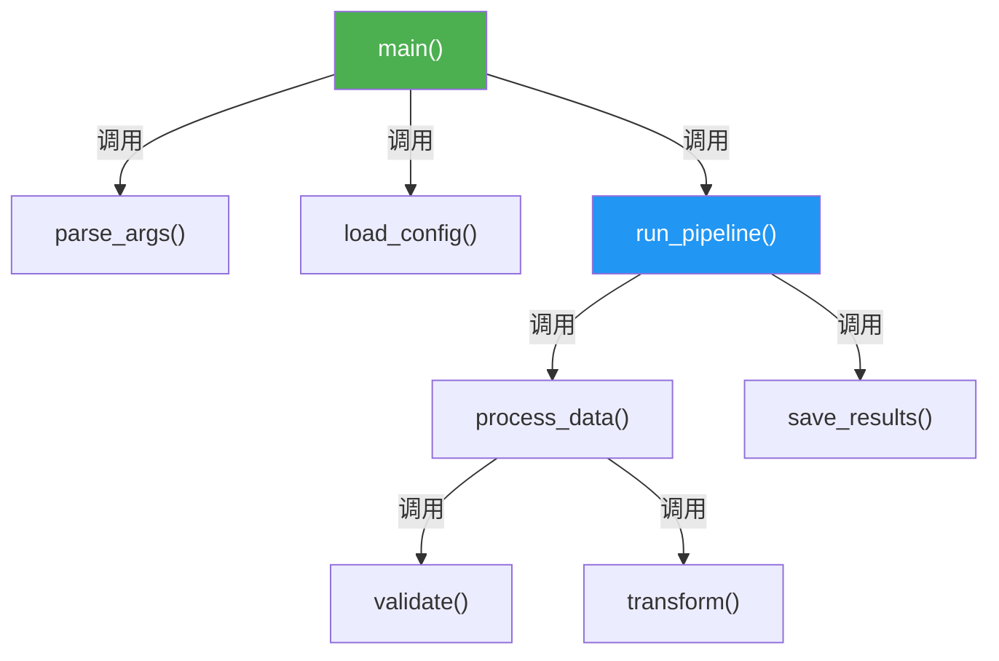
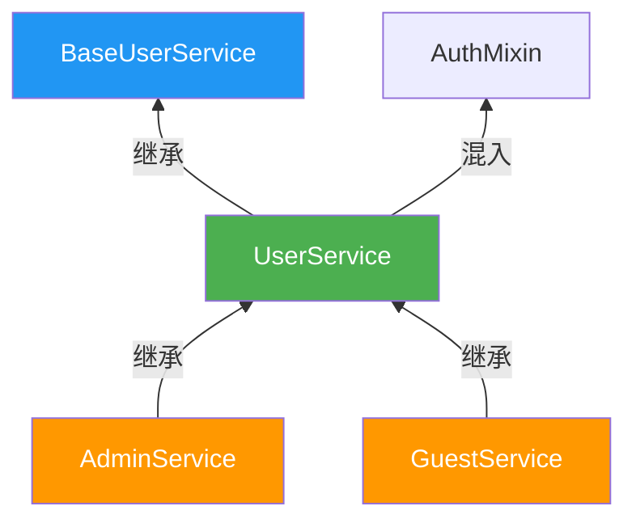

# LATTE - 代码注释智能生成工具

## 1. 项目概述

LATTE 是一个基于 **Node.js + TypeScript** 的命令行工具，自动分析源代码并生成代码注释与流程图。

核心能力：
- 分析函数的调用链（向上：谁调用了它；向下：它调用了谁）→ 生成**流程图**
- 分析类的继承关系（父类、子类）→ 生成**继承图**
- 为函数、类、关键变量生成规范化注释
- 通过 Git 管理注释变更

支持语言：Python、Java、C++（后续可扩展）。

未来扩展：提供 Electron 管理界面，支持打开文件夹、可视化查看/创建任务。

---

## 2. 核心概念

### 2.1 分析方向

| 方向 | 参数 | 含义 | 示例 |
|------|------|------|------|
| 向上分析 | `-p 0` | 查找谁调用了目标（调用者 / 父类） | 分析 `foo()` 向上 → `bar()` 调用了 `foo()` |
| 向下分析 | `-p 1` | 查找目标调用了谁（被调用者 / 子类） | 分析 `foo()` 向下 → `foo()` 内部调用了 `baz()` |

默认值：**`-p 1`（向下分析）**。

### 2.2 分析对象

| 对象 | 参数 | 说明 |
|------|------|------|
| 函数 | `-f <方法名>` | 函数名或 `ClassName.method_name` |
| 类 | `-c <类名>` | 类名 |

`-f` 和 `-c` 二选一，必填其一。

### 2.3 任务与子任务

- **任务 (Task)**：一次 `add` 命令对应一个任务，有唯一自增 ID。
- **子任务 (Subtask)**：任务内逐个分析发现的函数/类。初始只有目标本身，执行过程中**动态发现**新函数并追加。

---

## 3. 命令行接口 (CLI)

命令名：`latte-code-notes-agent`

### 3.1 `add` — 创建分析任务

```bash
latte-code-notes-agent add -f <方法名> [-p <0|1>]
latte-code-notes-agent add -c <类名>   [-p <0|1>]
```

| 参数 | 必填 | 默认值 | 说明 |
|------|------|--------|------|
| `-f` | 与 `-c` 二选一 | — | 目标函数名，支持 `func_name` 或 `ClassName.method_name` |
| `-c` | 与 `-c` 二选一 | — | 目标类名 |
| `-p` | 否 | `1` | `0` = 向上，`1` = 向下 |

**执行步骤：**
1. 校验参数（`-f` / `-c` 必须提供且只提供一个）
2. 在项目中搜索目标函数/类，确认存在（不存在则报错退出）
3. 自增生成任务 ID
4. 写入 `.latte/notes_list.json`（追加任务条目）
5. 创建目录 `.latte/notes/<ID>/`
6. 生成 `.latte/notes/<ID>/task.json`（含第一个子任务：目标本身）
7. 输出确认信息

**输出示例：**
```
✓ 任务已创建 (ID: 1)
  目标: 函数 main
  方向: 向下分析 (-p 1)
  子任务: 1 个（执行时会动态发现更多）
```

### 3.2 `run` — 执行一个子任务

```bash
latte-code-notes-agent run            # 默认取最近一个 in_progress 的任务
latte-code-notes-agent run <任务ID>   # 执行指定任务
```

| 参数 | 必填 | 默认值 | 说明 |
|------|------|--------|------|
| `<任务ID>` | 否 | `notes_list.json` 中最后一个 `in_progress` 任务 | 要执行的任务 ID |

**执行步骤：**
1. 读取 `.latte/notes/<ID>/task.json`，找到状态为 `pending` 的第一个子任务
2. 标记该子任务为 `running`
3. 分析该子任务对应的函数/类：
   - 解析代码，提取调用关系（函数）或继承关系（类）
   - **动态发现**：发现新的项目内函数/类 → 添加为新的 `pending` 子任务
   - 过滤标准库和第三方库调用（只分析项目内部代码）
4. 为该函数/类生成代码注释，写入源文件
5. 标记该子任务为 `completed`
6. 检查是否还有 `pending` 子任务：
   - **还有** → 输出进度，等待下次 `run` 或 `loop`
   - **没有了** → 生成流程图/继承图，执行 `git commit`
7. 追加日志到 `.latte/notes/<ID>/log.md`

**输出示例：**
```
▶ 任务 #1 | 子任务 #3: 分析函数 process_data()
  文件: src/processor.py:42
  发现调用: validate_input() → 新增子任务 #7
  发现调用: transform()     → 新增子任务 #8
  已生成函数注释 ✓
  进度: 3/8 子任务完成
```

### 3.3 `loop` — 循环执行直到全部完成

```bash
latte-code-notes-agent loop            # 循环执行最近未完成任务
latte-code-notes-agent loop <任务ID>   # 循环执行指定任务
```

**行为：** 反复执行 `run` 的逻辑，直到所有子任务均为 `completed`。

**终止条件：**
- 所有子任务完成 → 正常退出，输出汇总
- 任一子任务失败 → 停止，输出失败原因，保留已完成进度
- 用户 Ctrl+C → 保存当前进度，安全退出

**输出示例：**
```
▶ 循环开始: 任务 #1 (8 子任务)
  [1/8] ✓ main()
  [2/8] ✓ parse_args()
  [3/8] ✓ load_config()
  ...
  [8/8] ✓ save_results()
  生成流程图: .latte/notes/1/diagrams/main_flow.mmd
  Git commit: docs(notes): add code notes for main()
✓ 任务 #1 全部完成 (8/8)
```

### 3.4 `status` — 查看任务状态

```bash
latte-code-notes-agent status            # 所有任务概览
latte-code-notes-agent status <任务ID>   # 指定任务详情
```

**概览输出：**
```
任务列表:
  #1  函数 main()         (向下)  ████████████ 100%  5/5   ✓ 已完成
  #2  类 UserService       (向上)  ████░░░░░░░░  40%  2/5   ⏳ 进行中
  #3  函数 handle_request  (向下)  ░░░░░░░░░░░░   0%  0/3   ○ 待执行
```

**详情输出：**
```
任务 #2 详情:
  目标: 类 UserService
  方向: 向上分析 (父类)
  创建: 2026-04-07 14:30:00

  子任务:
    ✓ #1  UserService          src/service.py:10    completed
    ✓ #2  BaseUserService      src/base.py:3        completed
    ⏳ #3  AuthMixin            src/auth.py:7        running
    ○ #4  CacheDecorator       src/cache.py:15      pending
    ○ #5  LoggingProxy         src/logging.py:22    pending
```

---

## 4. 数据模型

### 4.1 `.latte/notes_list.json` — 任务索引

```jsonc
{
  "next_id": 3,          // 下一个任务 ID
  "tasks": [
    {
      "id": 1,
      "target_type": "function",    // "function" | "class"
      "target_name": "main",
      "direction": 1,               // 0=向上, 1=向下
      "status": "completed",        // "in_progress" | "completed" | "failed"
      "created_at": "2026-04-07T14:00:00",
      "completed_at": "2026-04-07T14:05:00"
    },
    {
      "id": 2,
      "target_type": "class",
      "target_name": "UserService",
      "direction": 0,
      "status": "in_progress",
      "created_at": "2026-04-07T14:30:00",
      "completed_at": null
    }
  ]
}
```

### 4.2 `.latte/notes/<ID>/task.json` — 任务详情

```jsonc
{
  "id": 1,
  "target_type": "function",
  "target_name": "main",
  "direction": 1,
  "created_at": "2026-04-07T14:00:00",
  "subtasks": [
    {
      "id": 1,
      "type": "function",           // "function" | "class"
      "name": "main",
      "status": "completed",        // "pending" | "running" | "completed" | "failed"
      "file": "src/main.py",
      "line": 10,
      "discovered_by": null,        // 由哪个子任务发现（null 表示是初始目标）
      "started_at": "2026-04-07T14:00:01",
      "completed_at": "2026-04-07T14:01:00"
    },
    {
      "id": 2,
      "type": "function",
      "name": "parse_args",
      "status": "completed",
      "file": "src/cli.py",
      "line": 5,
      "discovered_by": 1,           // 由子任务 #1 (main) 发现
      "started_at": "2026-04-07T14:01:01",
      "completed_at": "2026-04-07T14:02:00"
    }
  ]
}
```

### 4.3 `.latte/notes/<ID>/log.md` — 执行日志

```markdown
# 任务 #1: 函数 main (向下分析)

## 子任务 #1: main
- 时间: 2026-04-07 14:00:01
- 文件: src/main.py:10
- 发现调用: parse_args, load_config, run_pipeline
- 跳过: sys.argv (标准库)
- 已生成函数注释 ✓

## 子任务 #2: parse_args
- 时间: 2026-04-07 14:01:01
- 文件: src/cli.py:5
- 发现调用: argparse.ArgumentParser (标准库，跳过)
- 已生成函数注释 ✓
```

---

## 5. 目录结构

```
<项目根目录>/
├── .latte/                              # LATTE 工作目录（加入 .gitignore 或保留，由用户决定）
│   ├── notes_list.json                  # 全局任务索引
│   └── notes/
│       ├── 1/                           # 任务 #1
│       │   ├── task.json                # 任务详情 + 子任务列表
│       │   ├── log.md                   # 执行日志
│       │   └── diagrams/               # 生成的图表
│       │       ├── main_flow.mmd       # Mermaid 源文件
│       │       └── main_flow.png       # 导出的图片
│       └── 2/
│           └── ...
├── src/                                 # 用户的源代码（注释直接写入这里）
└── ...
```

---

## 6. 分析策略

### 6.1 函数分析（`-f`）

**向下分析 (`-p 1`)：**
1. 定位目标函数定义（文件 + 行号）
2. 解析函数体，提取所有函数调用
3. 过滤：仅保留项目内部函数（排除标准库、`node_modules`、第三方包）
4. 为每个发现的内部函数创建 `pending` 子任务
5. 递归：后续子任务执行时继续发现，直到无新函数

**向上分析 (`-p 0`)：**
1. 定位目标函数定义
2. 在项目中全文搜索调用该函数的位置
3. 提取调用者函数名，创建子任务
4. 递归向上追踪调用者

### 6.2 类分析（`-c`）

**向下分析 (`-p 1`)：**
1. 定位目标类定义
2. 搜索所有继承/实现自该类的子类
3. 为每个子类创建子任务，递归向下

**向上分析 (`-p 0`)：**
1. 定位目标类定义
2. 提取其继承的父类（直接父类）
3. 为每个父类创建子任务，递归向上

### 6.3 去重规则

- 同一任务中，`type + name + file` 组合唯一，不重复添加
- 已是 `completed`、`running` 或 `pending` 状态的子任务不重复入队

### 6.4 跳过规则

以下调用**不创建子任务**：
- 语言标准库（如 `os.path.join`、`java.lang.*`、`std::vector`）
- 第三方库（如 `node_modules`、`pip` 包）
- 内置关键字/运算符

---

## 7. 注释规范

### 7.1 函数注释

**Python（docstring）：**
```python
def process_data(input_path: str, batch_size: int = 100) -> list[dict]:
    """处理数据文件并返回结果列表.

    读取指定路径的数据文件，按批次解析并验证数据，
    最终返回处理后的结果列表。

    Args:
        input_path: 数据文件路径，支持 csv/json 格式
        batch_size: 每批处理的数据条数，默认 100

    Returns:
        处理后的数据列表，每个元素为字典

    Raises:
        FileNotFoundError: 数据文件不存在
        ValueError: 数据格式不合法

    Callers:
        main() → src/main.py:15
    """
```

**Java（Javadoc）：**
```java
/**
 * 处理数据文件并返回结果列表.
 *
 * <p>读取指定路径的数据文件，按批次解析并验证数据。</p>
 *
 * @param inputPath 数据文件路径，支持 csv/json 格式
 * @param batchSize 每批处理的数据条数，默认 100
 * @return 处理后的数据列表
 * @throws FileNotFoundException 数据文件不存在
 * @caller main() → src/Main.java:15
 */
```

**C++（Doxygen）：**
```cpp
/**
 * @brief 处理数据文件并返回结果列表.
 *
 * 读取指定路径的数据文件，按批次解析并验证数据。
 *
 * @param input_path 数据文件路径
 * @param batch_size 每批处理的数据条数，默认 100
 * @return std::vector<dict> 处理后的数据列表
 * @throws std::runtime_error 文件不存在或格式错误
 * @caller main() → src/main.cpp:15
 */
```

**注释模板统一包含：**
| 段落 | 必填 | 说明 |
|------|------|------|
| 简述 | 是 | 一句话描述函数用途 |
| 详细描述 | 否 | 复杂逻辑时补充 |
| Params | 是 | 每个参数的含义 |
| Returns | 是 | 返回值说明 |
| Raises/Throws | 否 | 可能抛出的异常 |
| Callers | 否 | 仅向上分析时添加，标注谁调用了本函数 |

### 7.2 类注释

**Python：**
```python
class DataProcessor:
    """数据处理器，负责批量数据的读取、清洗和转换.

    支持多种数据源格式（CSV、JSON），提供批量处理能力。
    继承自 BaseProcessor，扩展了数据验证功能。

    Inheritance:
        Parent: BaseProcessor → src/base.py:5
        Children: AsyncDataProcessor → src/async_processor.py:3

    Key Methods:
        process() → 处理单批数据
        validate() → 验证数据格式
        transform() → 数据格式转换
    """
```

**Java：**
```java
/**
 * 数据处理器，负责批量数据的读取、清洗和转换.
 *
 * <p>支持多种数据源格式（CSV、JSON），提供批量处理能力。</p>
 *
 * @inheritance Parent: BaseProcessor → src/BaseProcessor.java:5
 *              Children: AsyncDataProcessor → src/AsyncDataProcessor.java:3
 */
```

### 7.3 变量注释

仅注释以下类型（不过度注释）：

| 类型 | 示例 | 格式 |
|------|------|------|
| 模块级常量 | `MAX_RETRY = 3` | 行尾注释：`# 最大重试次数` |
| 类属性 | `self.batch_size: int` | 行尾注释或在 `__init__` docstring 中说明 |
| 复杂类型 | `data: dict[str, list[tuple]]` | 行尾注释说明结构 |

---

## 8. 流程图规范

使用 **Mermaid** 语法生成，同时导出 PNG。

### 8.1 函数调用流程图



| 规则 | 说明 |
|------|------|
| 节点标签 | 函数名 + `()` |
| 箭头 | `-->`，标签写 "调用" |
| 方向 | 从上到下 (TD) |
| 颜色 | 入口函数绿色，中间核心函数蓝色，叶子函数无特殊样式 |

### 8.2 类继承图



| 规则 | 说明 |
|------|------|
| 节点标签 | 类名 |
| 箭头 | `-->`，标签写 "继承" 或 "混入" |
| 方向 | 从下到上 (BT)：子类在下，父类在上 |
| 颜色 | 目标类绿色，父类蓝色，子类橙色 |

---

## 9. 任务生命周期

```
 add 命令
    │
    ▼
┌───────────┐
│  created   │  任务创建，子任务仅含目标本身
└─────┬─────┘
      │ run / loop
      ▼
┌─────────────┐
│ in_progress  │ ←────────────────────┐
└─────┬───────┘                       │
      ▼                               │
 取下一个 pending 子任务                │
      │                               │
      ▼                               │
 标记为 running                        │
      │                               │
      ▼                               │
 解析代码 → 发现新函数 → 追加 pending   │
      │                               │
      ▼                               │
 生成注释，写入源文件                    │
      │                               │
      ▼                               │
 标记为 completed                      │
      │                               │
      ▼                               │
 还有 pending？ ── 是 ────────────────→│
      │
      否
      ▼
┌───────────┐
│ completed  │  生成图表 → git commit
└───────────┘

(任一步骤失败 → 子任务标记 failed，任务停止)
```

---

## 10. Git 集成

### 10.1 Commit 规范

```
docs(notes): add code notes for <目标名>
```

示例：
- `docs(notes): add code notes for main()`
- `docs(notes): add code notes for UserService`

### 10.2 Commit 内容

一个任务**全部子任务完成后**生成一次 commit，包含：
- 所有被修改的源文件（含新增注释）
- 生成的图表文件（`.mmd` + `.png`）

### 10.3 `.gitignore` 建议

```gitignore
# 中间状态文件（可选忽略）
.latte/notes/*/task.json
.latte/notes/*/log.md
```

保留图表文件，忽略中间过程文件。用户可自行决定。

---

## 11. 错误处理

| 场景 | 行为 | 退出码 |
|------|------|--------|
| 未指定 `-f` 或 `-c` | 输出用法提示 | `1` |
| `-f` 和 `-c` 同时指定 | 报错：`-f 和 -c 不可同时使用` | `1` |
| 目标函数/类在项目中不存在 | 报错：`未找到函数 "foo"` | `1` |
| `.latte/` 目录不存在 | 自动创建 | — |
| `notes_list.json` 不存在 | 自动创建空结构 | — |
| 指定任务 ID 不存在 | 报错：`任务 #99 不存在` | `1` |
| 子任务执行失败 | 标记 `failed`，停止，保留已完成进度 | `2` |
| 源文件无法解析 | 跳过该子任务，记录警告，继续下一个 | — |
| git commit 失败 | 保留文件修改，提示用户手动 commit | `3` |
| 无 pending 子任务可执行 | 提示：`任务 #1 已全部完成` | `0` |

---

## 12. Electron 管理界面（远期规划）

> 此功能为远期扩展，当前阶段不实现，仅记录需求方向。

**核心功能：**
- 打开项目文件夹，自动识别 `.latte/` 目录
- 可视化展示任务列表及其状态
- 通过 UI 创建/删除/重试任务
- 预览生成的流程图和继承图
- 查看子任务执行日志

---

## 13. 设计决策（待确认）

> 开发前需确认以下事项。当前为建议方案。

| # | 问题 | 建议方案 | 备选方案 |
|---|------|----------|----------|
| 1 | 代码解析方式 | Tree-sitter 做 AST 解析（精确、离线） | LLM 直接分析（灵活、需联网） |
| 2 | CLI 框架 | `commander` + `inquirer` | `yargs` |
| 3 | Mermaid → PNG | `@mermaid-js/mermaid-cli` | `puppeteer` 自行渲染 |
| 4 | 注释写入策略 | 直接修改源文件（原地插入注释） | 生成 `.patch` 文件，由用户决定是否应用 |
| 5 | 任务执行方式 | 串行（一个子任务完成后再做下一个） | 并行（同时分析多个子任务） |
| 6 | 已有注释的处理 | 跳过已有注释的函数，不覆盖 | 覆盖更新 |
| 7 | 配置文件 | 项目根目录放 `.latterc.json` 配置语言、忽略路径等 | 纯命令行参数，无配置文件 |
